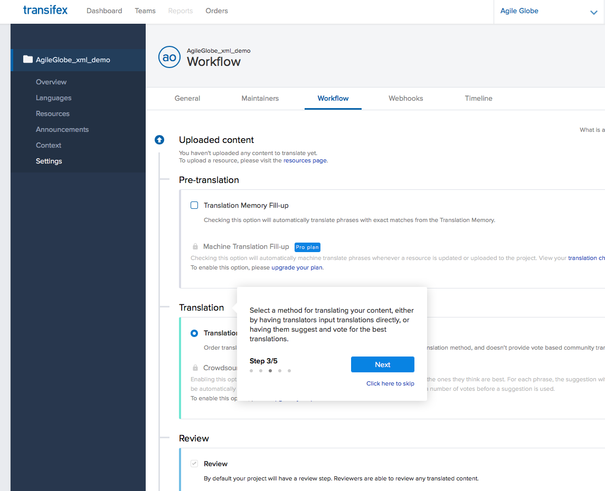

Guided Tour
##############

:date: 2018-04-10 

向导（Guided Tour）就像现实生活中的导游一样，可以给用户介绍各个功能的分布，以及一些简要的步骤。向导一般悬浮在应用程序之上，用户首次使用时能快速熟悉系统。不少研究发现，有效的用户向导，可以提高用户粘性，降低用户呼叫客服的成本。

示例：

开源解决方案
===============

* `Crumble <https://link.zhihu.com/?target=http%3A//blog.tommoor.com/crumble/>`_ 。通过非常可爱的蓝色泡泡进行提示。
* `Bootstrap Tour<https://link.zhihu.com/?target=http%3A//bootstraptour.com/>`_ 。基于bootsrap实现的Tour。
* `Joyride <https://link.zhihu.com/?target=https%3A//zurb.com/playground/jquery-joyride-feature-tour-plugin>`_ 。JS+CSS实现
* `HopScotch <https://link.zhihu.com/?target=http%3A//linkedin.github.io/hopscotch/>`_。一个向导框架，可以JSON作为输入，开发人员通过API调用即可。

商业解决方案
=================

* `Walkme <https://link.zhihu.com/?target=https%3A//www.walkme.com/>`_ . 可以制作非常漂亮专业的用户向导